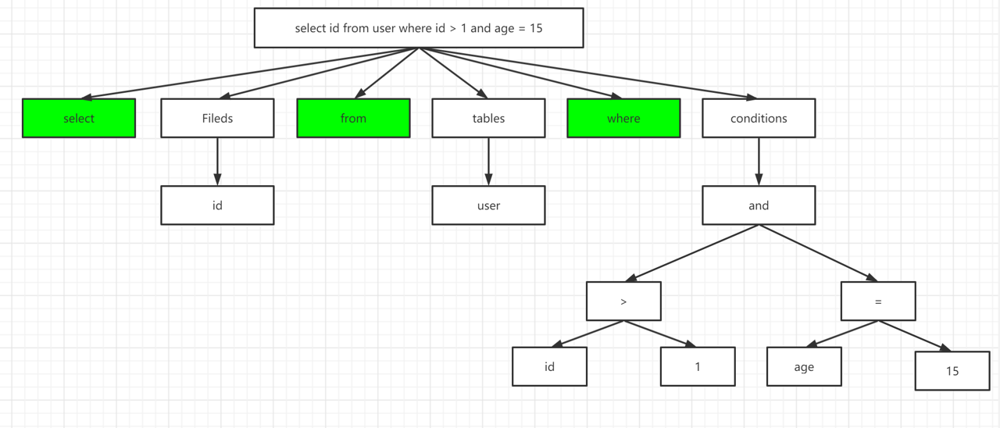

# 前言

这篇文章演示环境为：MySQL5.7。

主要内容为基于[MySQL5.7官方文档](https://dev.mysql.com/doc/refman/5.7/en/)的学习，对MySQL Select语句执行流程相关内容的整理及自己的理解。

如有错误或疑问，欢迎讨论！

<!-- more -->

# select 执行流程

## 连接

**客户端**通过MySQL数据库**连接器**连接到MySQL服务。

**客户端**将SQL语句：*select id from user where id > 1 and age = 15*传入MySQL服务。

## 查询缓存

MySQL在**查询缓存**（Query Cache)中检查是否存在与传入SQL语句一模一样的语句，若存在则返回结果集。

## 词法、语法解析

若未命中缓存或未开启**查询缓存**（Query Cache），则将SQL语句传入**解析器**模块（parser）

**解析器**将SQL语句打散为select、id、from、user、where、id、>、1、and、=、15这11个符号，并记录每个符号是什么类型，符号间顺序

随后对打散的符号进行语法检查，若语法检查到错误则报错返回

语法检查通过后，基于MySQL定义的语法规则，根据SQL语句生成一个数据结构（**解析树**）

## 预处理

**解析器**生成**解析树**后，将**解析树**传入**预处理器**

**预处理器**对**解析树**进行语义解析，检查生成的**解析树**中是否存在表名错误、字段名错误、别名错误等，并生成**新的解析树**

## 优化

**预处理器**生成的**新的解析树**后，将**新的解析树**传入**优化器**

**优化器**通过MySQL优化规则优化**解析树**，并根据**解析树**生成不同的**执行计划**，然后选择一种开销（cost）最小**最优的执行计划**。

> MySQL优化器仅会对sql进行一些简单的优化，例如：
>
> 判断sql中是否存在恒等式或恒不等式（若存在则移除或返回）
> 
> 判断sql执行结果是否直接从索引中获取等等

## 查询

**优化器**生成最优的**执行计划**后，将**执行计划**传入对应的**存储引擎**（存储引擎在建表时指定，若未指定则选用默认存储引擎，MySQL5.7默认存储引擎为Innodb）

**存储引擎**会通过**执行计划**在实际数据文件内查询数据，返回。